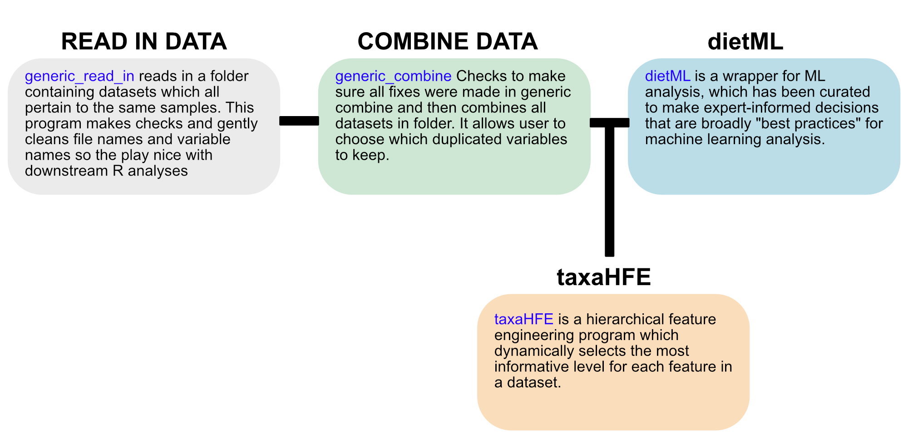

# Nutrition Tools
 This repository contains useful scripts for taking data to ML analysis, especially with nutritionists in mind.

 Prerequisites
- Basic knowledge of a shell terminal 
- [git](https://git-scm.com/book/en/v2/Git-Basics-Getting-a-Git-Repository#:~:text=Cloning%20an%20Existing,prev%20%7C%20next)  (or some other way to download/clone this repository)
- [docker desktop](https://www.docker.com/products/docker-desktop/) for the Rstudio envirnoment
- An internet connection


[EXAMPLE RUN THROUGH](https://github.com/aoliver44/nutrition_tools#example-run-through)

--------------------------------------------------



--------------------------------------------------

### **1. Clone the environment from Github**

```
## download repository
git clone https://github.com/aoliver44/nutrition_tools.git
cd nutrition_tools
```
This will pull down the scripts and dockerbuild files necessary to run these scripts

--------------------------------------------------

### **2. Build the Docker Environment**

Prior to doing anything in docker, make sure it is running on your computer. Find it in your applications folder, or wherever you downloaded it, and start it (often this means just double clicking the icon). Docker desktop for macs should put a docker icon (a fish with boxes on top) near the time-date part of the menu bar to let you know it is running. You can use the docker desktop application to configure CPU and memory resources for both [Macs](https://docs.docker.com/desktop/settings/mac/#:~:text=Resources%F0%9F%94%97,and%20other%20resources.) and [PCs](https://docs.docker.com/desktop/settings/windows/#:~:text=Resources%F0%9F%94%97,or%20Windows%20containers) and [Linux machines](https://docs.docker.com/desktop/settings/linux/#:~:text=Resources%F0%9F%94%97,and%20other%20resources.).

Now navigate to a terminal (I am not sure how this all works in Powershell. I suggest using Ubuntu Terminal for windows).

 ```
## Option 1 (preferred), local installation:
docker pull aoliver44/nutrition_tools:base_1.6
```

```
## Option 2: Build it yourself! Still local installation.
## On my quad-core i7 2020 macbook pro, took 43 minutes.
## this command will only work if you are in the downloaded
## git repository nutrition_tools 
docker build -t nutrition_tools:base_1.6 .

## to run
docker run --rm -it -v /path/to/github_repo/nutrition_tools:/home/docker -w /home/docker aoliver44/nutrition_tools:base_1.6 bash
```

```
## Option 3: You are using singularity (assuming its in your path.
## you might need to load a module or something). Usually remote installation.
## **NOTE:** I do not know much about singularity
## pull image from internet
singularity pull nutrition_tools.sif docker://aoliver44/nutrition_tools:base_1.6
## run image
singularity run -w -W /path/to/working/directory --bind /path/to/cloned/github/repo:/home/docker nutrition_tools.sif bash
cd /home/docker
```

```
########### example (local installation): ###########

docker run --rm -it -v /Users/$USER/Downloads/nutrition_tools/:/home/docker -w /home/docker aoliver44/nutrition_tools:base_1.6 bash
 ```

The above example command (entierly dependent on where you downloaded the repository to your computer -- in this case it was downloaded to a folder with the path ~/Downloads --will start the docker container and provide a bash terminal to the user. 

When you ```ls``` inside /home/docker, you should see whatever you mounted to this directory inside the docker container (whatever is in the folder to the left of the ":" in the above command (in this case the directory "/User/$USER/Downloads/nutrition_tools/")

You are now operating inside a container, which contains the software necessary to run the following analyses.

**NOTE:** To exit the terminal, run ```exit``` or press ctrl+d on a mac

------------------------------------------

### **3. Run generic_read_in**

```
Read in a directory of data and make checks prior to ML
Usage:
    generic_read_in [--subject_identifier=<subject_colname>] <input> <outdir>
    
Options:
    -h --help  Show this screen.
    -v --version  Show version.
    --subject_identifier name of columns with subject IDs [default: subject_id]

Arguments:
    input  FULL path of input directory containing files
    outdir  FULL path of output directory name 
########### example: ###########

generic_read_in --subject_identifier subject_id /home/docker/simulated_data/ /home/docker/simulated_output 

```
**Desired input:** A flat-file(s) where each row has a unique identifier (a subject or sample ID) and each column is some feature measured. Should multiple files exist, the unique identifier will be present in all files.

This script will read in a directory of files (.csv | .txt | .tsv) and attempt to run some basic checks on them and basic cleaning. For example:
1. Check to see if a key is present that will link all the data together if split in multiple files (i.e. "subject_id")
2. Check to see if subject_id is unique across rows or if there are duplicated values
   - Duplicated subject ids suggest longitudinal data. The downstream ML methods in this work does not work well with longitudinal data 
3. Check to see if there are duplicated column names
   - Sub-check: if the column names are duplicated, is the data also duplicated?
4. Keep a tally of columns that contain NAs.
5. Check to see if you have time-series data and discourage that
   - Note: this program and many ML programs struggle with longitudinal data. However, as long as all subject_ids are unique, the program will run.
   
**Output:**
 - **na_counts.csv**: counts of nas found in the input data
 - **na_counts.pdf**: vizualization of the nas
 - **summary_problems.csv**: summarizing where problems occured during import, which may cause downstream problems. The columns are as follows:
   - <i>dataset</i>: Name of dataset
   - <i>subject_id_not_found</i>: This file has no identifible key/subject_id
   - <i>subject_id_duplicated</i>: This appears to be longitudinal data Take care in using ML
   - <i>date_not_unix</i>:Time formats are messy Please standarize to Unix or drop
   - <i>duplicated_data</i>: You have columns with the same name and same data.  Please drop redundant columns
   - <i>duplicated_column_names</i>: You have the DIFFERENT data in columns with the same name. WHAT? This is sloppy.
 - **/clean_files**: new set of files that have been cleaned and checked for duplicate data
 - **/duplicate_colnames**: files that show where the column name was duplicated but the underlying data was different
 - **/duplicated_data**: files that show where the column name was duplicated and the data was also duplicated

**NOTES:** This program came about from large collaborations where many different datasets were being emailed around and subsequently combined for later analysis. It will still check a single file.

Also, if this script identifies problems and creates a summary_problems.csv file, the next script will check and make sure you fixed these problems, otherwise it will drop the dataset from the analysis. 

It is good practice generally, and **vital for these scripts to work properly**, for you to supply full paths to directories (inside the docker container). The examples here show this, i.e. ```/home/docker/simulated_data``` and **NOT** just ```simulated_data``` or ```~/simulated_data```

------------------------------------------

### **4. Run generic_combine**
 ```
Combine data from read_in step, prior to ML
Usage:
    generic_combine [--subject_identifier=<subject_colname> --label=<label> --cor_level=<cor_level> --cor_choose=<cor_choose> --preserve_samples=<preserve_samples>] <input> <output_file>
    
Options:
    -h --help  Show this screen.
    -v --version  Show version.
    --subject_identifier name of columns with subject IDs [default: subject_id]
    --label label of column for use in ML [default: label]
    --cor_level level of general feature correlation [default: 0.99]
    --cor_choose choose which features are kept in correlation [default: FALSE]
    --preserve_samples attempt to drop more features to keep samples [default: FALSE]
    
Arguments:
    input  FULL path of input directory containing files
    output_file  output file name

########### example: ###########

generic_combine --subject_identifier subject_id --label label --cor_level 0.99 --cor_choose TRUE --preserve_samples FALSE /home/docker/simulated_output/ merged_data.csv
 ```

This script will take the output of ```generic_read_in``` and combine all the files together. It will do 3 major things:
1. Check and see if problems identified in ```generic_read_in``` step were addressed. If they were not addressed, these problematic datasets will be DROPPED. If all datasets get dropped, the program will error out.
2. Correlate (Spearman) combined featureset at a user-defined threshold [default: 0.99]. This is to identify HIGHLY redundant features. We do not view this as a feature engineering step, because the threshold is so high (it is mainly looking for copied data that has different column names). In the next ML step, a correlation-based feature engineering step can set a much lower threshold more safely (does not contribute to data leakage like this step could).
3. For the features that are correlated at > 0.99, this program will let the user choose the features that get written to the final dataset. 
4. One-hot encode factors
    - Note: the method for one-hot encoding here creates new factors with new names. Note, it will **NOT** one-hot encode the label that will be used in ML (the factor you want to predict...***if it is a factor***). This is because downstream ML (```dietML```) uses the R program ranger. Ranger expects the label used in RF classification to **NOT** be a 0,1 (which is exactly what one-hot encoding does). If your label is 0 or 1, and is a factor, please change to A,B or control, treatment, etc.
  
**OUTPUT:** (1) A .csv file for use in ML in the directory of the input. (2) a feature_summary.csv file which tells you what features you started with
  
  **NOTES:** The ```--preserve_samples``` flag attempts to lower the threshold of what is considered a feature with too many NA's (a sample with any amounts of NAs gets dropped...so it is a balancing act of dropping features and samples in order to have the most complete dataset). The final dataset should be complete; this version of this pipeline does not impute missing data. Default behavior is set to false, which for most of our test cases did not lead to many "extra" lost samples. Initially, features are dropped if they have greater than 50% NAs, and samples are dropped if they have greater than 75% NAs. Next, the details of this flag are that it looks at the distribution of NAs across all features, and if ```--preserve_samples TRUE```, then it will take the min number of NAs as the threshold for dropping features (thus removing more features in an effort to keep samples). If ```--preserve_samples FALSE```, the 25% percentile of NAs will be set as threshold for dropping features. Finally, all samples with remaining NAs are dropped, thus making a complete dataset. IF you have a dataset with many NA-replete features, consider setting this flag to ```--preserve_samples TRUE```; however, expect a loss of features.


------------------------------------------

### **5. Run diet_ML**

```
Run regression or classification ML models on a dataframe
Usage:
    dietML [--subject_identifier=<subject_id> --label=<label> --cor_level=<cor_level> --train_split=<train_split> --model=<model> --metric=<metric> --type=<type> --seed=<seed> --tune_length=<tune_length> --tune_time=<time_limit> --shap=<shap> --ncores=<ncores>] <input> <outdir>
    
Options:
    -h --help  Show this screen.
    -v --version  Show version.
    --subject_identifier name of columns with subject IDs [default: subject_id]
    --label name of column that you are prediction [default: label]
    --cor_level level to group features together [default: 0.95]
    --train_split what percentage of samples should be used in training 
            [default: 0.70]
    --model what model would you like run 
            (options: rf,lasso,ridge,enet) [default: rf]
    --metric what metric would you like to optimize in training 
            (options: roc_auc, bal_accuracy, accuracy, mae, rmse, rsq, kap, 
             f_meas) [default: bal_accuracy]
    --type for models that do both regression and classification 
            [default: classification]
    --seed set random seed [default: 42]
    --tune_length number of hyperparameter combinations to sample [default: 80]
    --tune_time length of time tune_bayes runs [default: 10]
    --shap attempt to calcualte shap values? [default: FALSE]
    --ncores number of processesing cores for parallel computing [default: 2]
    
Arguments:
    input  FULL path to input file for ML (output from generic_combine.R)
    outdir FULL path where results should be written

########### example: ###########
dietML --label label --cor_level 0.95 --train_split 0.7 --model lasso --type classification --metric bal_accuracy --ncores 2 --tune_length 10 /home/docker/simulated_output/merged_data.csv /home/docker/simulated_output/ml_results/
```

The final script in this pipeline takes a clean (no missing data!) dataframe and performs a (relatively) basic ML analysis. 

Info about the flags:

--label: the name of the column in your input dataset (such as output from generic_combine) that you are trying to predict with ML

--cor_level: the correlation level to use in feature engineering. This correlation takes place inside each resampling, which does not contribute to data leakage. An interesting discussion can be found [here](https://stats.stackexchange.com/questions/378426/parameter-tuning-with-vs-without-nested-cross-validation).

--train_split: the percent of your entire dataset that is reserved for training and hyperparameter tuning. For example, a value of 0.7 would mean that 70% of the input data was used for training and optimizing the model, and 30% was left to test the model. This 30% is important: it is generally a good idea to leave out data that the model has NOT seen, in order to assess its performance. Alternative methods exist, but a true train-test split is a great way to prevent over-fitting. Inside model building, a 10-fold repeated (3x) cross-validation procedure will be used to evaluate pre-processessing steps and hyperparameters. 

--model: The models availible currently are lasso, ridge, elastic net, random forest.

- lasso: least absolute shrinkage and selection operator. This model uses L1 regularization, which in simple terms means that the penalties placed on feature coeffiecents are allowed to reduce the coefficent to zero (effectively removing the feature from the model). LASSO models can "inherently" feature select, meaning that the resulting model will only include the most informative features.
  - Hyperparameter search space: alpha = 1 (L1 regularizaion), lambda values are chosen by running the training data through glmnet::cv.glmnet() 7 times, and creating a list of all lambda values tested. 7 times is used to create a lambda search space as large as the elastic net lambda search spaces (which searches for a set of lambdas for 7 different values of alpha). This search space is the grid for training the caret model.
- ridge: If you understand LASSO, ridge is very similar. It fuctions similarly, except the penalties placed on feature coefficents are NOT allowed to reduce them to zero (L2 regularization). Therefore, all features exist in the final model. 
  - Hyperparameter search space: same as LASSO, except alpha = 0 (L2 regularization). This search space is the grid for training the caret model.
- Elastic net: This is a combination of LASSO and ridge. This model linearly combines L1 and L2 regularization. 
  - Hyperparameter search space: For a range of alpha values (0.2-0.8, by 0.1), a list of lambda values is created using glmnet::cv.glmnet(). This search space is the grid for training the caret model.
- Random forest: a ensemble model which uses a "forest" of decision trees to classify samples.
  - Hyperparameter search space: a (random) grid search of 3 hyperparameters (mtry, splitrule, and minimum node size). These hyperparameters were chosen because they are the main ones tuned inside the R Caret package for the Ranger random forest models. The actual grid will be defined to take into account features that may be lost in the pre-processessing step. As an example, if your feature set is 30, and you lose 5 features due to correlation pre-processessing, setting mtry to 27 (for example) will cause the program to error out. ```dietML``` attempts to heuristically set hyperparameters so the program doesn't error out. This search space is the grid for training the caret model.

--metric: metric that should be optimized during hyperparameter tuning. Currently, dietML supports balanced accuracy (bal_accuracy), kappa (kap), ROC AUC, F-measure, and accuracy for classification. Most of these metrics will auto-detect if the classification is a multi-class problem and weight accordingly (e.g. macro-averaged for balanced accuracy). For regression, metrics include mean absolute error (mae), R-squared (rsq), root mean squared error (rsme). You can read more about these metrics in the Yardstick R package [documentation] (https://yardstick.tidymodels.org/articles/metric-types.html#metrics). 

--type: whether the user is trying to accomplish classification (your label has discrete levels) or regression (your label is continous).

--seed: there is a fair amount of stochasticity inside these models already (for instance, glmnet::cv.glmnet() "hot-starts" at a different place each time, resulting in slightly different lambdas assessed). The --seed flag lets you adjust the overall seed of the program. If the models are re-run many times, this is a good flag to interate over. In my own testing, for smaller datasets its a good idea to iterate over 5-10 seeds to understand variability in results. This variability is likely due to different test-train splits.

--tune_length: The hyperparameter grid this program auto-generates can be VERY large. This would mean the program runs for a very long time. Often times it doesnt make a large difference in the model performance by testing ALL the hyperparameter combinations. By setting this to a resonable number of combinations, the model will train faster! What is reasonable? That is hard to answer. In LASSO, the models train pretty fast...so testing 500 hyperparameter combinations does not take terribly long to do on a local machine. Alternatively, a random forest takes longer to train, so 500 hyperparameter combinations would take a very long time. If the user specifies a value larger than the size of the auto-generated grid, the search will default to the entire grid (an exhuastive grid search). 

--ncores: number of parallel processes to use in model training. This can greatly speed up the time it takes to train. **NOTE:** use this at your own risk on an HPC system. In my brief testing, setting this to reasonable number, 16 cores, seemed to light up 64 cores. Im still not sure how the doParallel package in R translates to an HPC system. 

------------------------------------------

### **EXAMPLE RUN THROUGH**

```
## step 1:
docker run --rm -it -v /Users/$USER/Downloads/nutrition_tools/:/home/docker -w /home/docker aoliver44/nutrition_tools:base_1.6 bash

## step 2:
generic_read_in --subject_identifier subject_id /home/docker/simulated_data/ /home/docker/simulated_output 

## step 3:
generic_combine --subject_identifier subject_id --label label --cor_level 0.99 --cor_choose TRUE --preserve_samples FALSE /home/docker/simulated_output/ merged_data.csv

## step 4:
dietML --subject_identifier subject_id --label label --cor_level 0.80 --model rf --metric bal_accuracy --type classification --tune_length 30 --tune_time 2 --shap TRUE --ncores 2 /home/docker/simulated_output/merged_data.csv /home/docker/simulated_output/ml_results/

```
